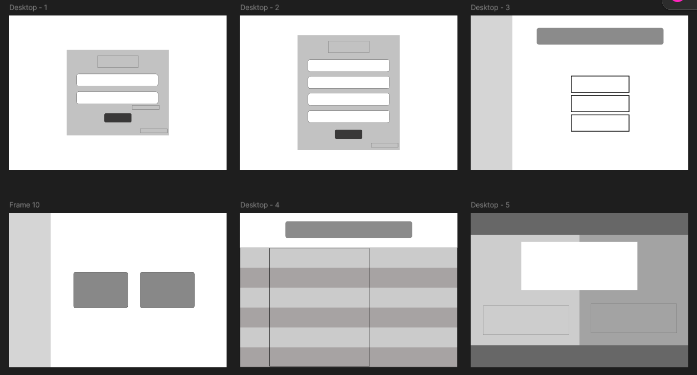

# Hand Cricket

A thrilling Hand Cricket game that offers multiple game modes, including basic cricket with numbers, Quickplay, and Tournament play. Dive into a unique experience with an intuitive UI and a variety of engaging features.

## 🎯 Objective

To provide an exciting, interactive Hand Cricket game with numbers, blending traditional cricket elements with a modern, user-friendly interface and rich gameplay features.

## 🏃‍♂️ Work Flow

- **Login**: Secure and personalized access.
- **Home**:
  - Quickplay
  - Tournament
- **Tournament**:
  - Schedule for upcoming matches.
- **Gaming**:
  - **Current Score**: Display the ongoing score in real-time.
  - **Toss**: Randomized coin toss for team selection.
  - **Over**:
    - Overs Passed: Track the overs played.
    - Current Over Score: View score for the ongoing over.
  - **Target**: Display target for chasing.
    - II Inning: Keep track of the second inning.
    - Balls and Runs Remaining: Show balls and runs left to chase.
- **Result**:
  - Summary of the match outcome.
  - **Man of the Match**: Highlight the player of the game.
- **Stats**:
  - Matches Played: Count of total matches played.
  - Highest Score: Display the best score achieved.
  - Average Score: Calculate average score over all matches.

## 🛠️ Tech Stack

The game is developed using the following technologies:

- **HTML**: Structure and content.
- **CSS**: Styling and layout design.
- **JavaScript**: Game logic and interactivity.
- **React JS**: Enhance UI and manage application state efficiently.

# 🚀 Get Started

## Wireframe

